# System Architecture - Ai.Orchestrator

## Architecture Overview

Ai.Orchestrator follows a modular, plugin-driven architecture built on .NET 8, designed for extensibility, testability, and scalability.

## System Components Diagram

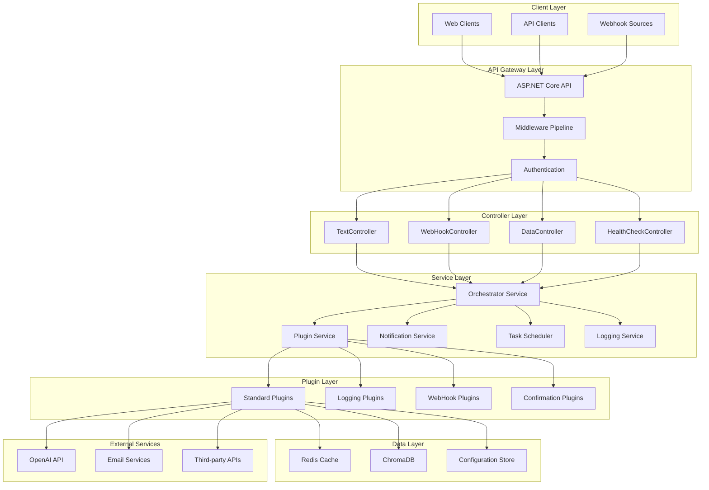

## Layered Architecture

### 1. Presentation Layer
```
├── Controllers/
│   ├── TextController      # Natural language processing
│   ├── WebHookController   # Webhook event handling
│   ├── DataController      # Direct data operations
│   └── HealthCheckController # System health monitoring
```

**Responsibilities:**
- HTTP request/response handling
- Input validation
- Response formatting
- API versioning
- Rate limiting

### 2. Business Logic Layer
```
├── Services/
│   ├── Orchestrator        # Core orchestration logic
│   ├── PluginService       # Plugin lifecycle management
│   ├── NotificationService # Notification orchestration
│   ├── TaskScheduler       # Background task scheduling
│   └── LoggingService      # Centralized logging
```

**Responsibilities:**
- Business rule implementation
- Workflow orchestration
- Plugin coordination
- Transaction management
- Error handling

### 3. Plugin Layer
```
├── Plugins/
│   ├── IPlugin             # Standard plugin interface
│   ├── ILoggingPlugin      # Logging provider interface
│   ├── IWebHookPlugin      # Webhook handler interface
│   └── IConfirmationPlugin # User confirmation interface
```

**Responsibilities:**
- Feature implementation
- External service integration
- Tool execution
- Custom business logic
- Data transformation

### 4. Data Access Layer
```
├── Repositories/
│   ├── Configuration       # Config data access
│   ├── Memory             # Memory store access
│   └── Persistence        # Persistent storage
```

**Responsibilities:**
- Data persistence
- Query optimization
- Connection management
- Transaction handling
- Caching strategies

## Plugin Architecture

### Plugin Loading Sequence

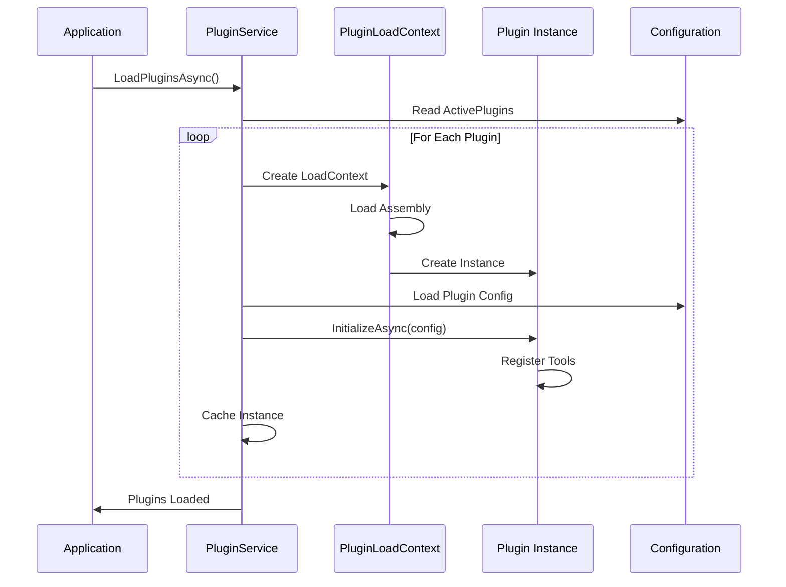

### Plugin Execution Flow

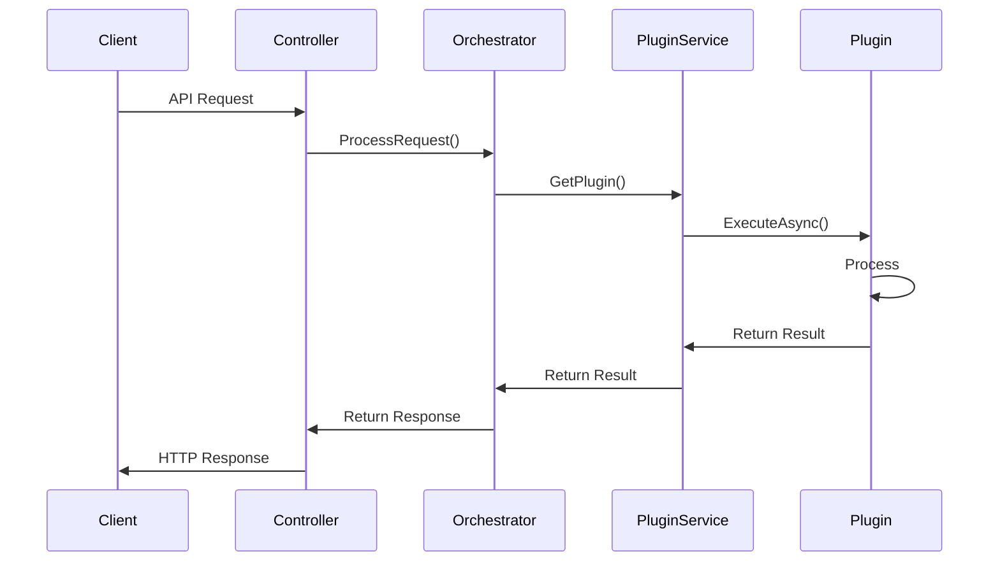

## Service Interactions

### Request Processing Pipeline

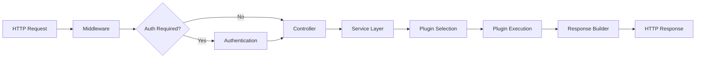

### Notification Flow

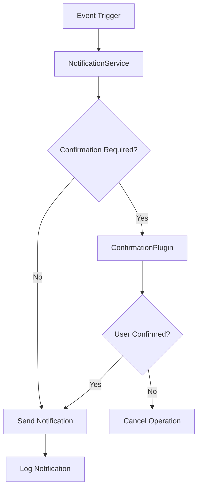

## Data Flow Architecture

### Memory Management Strategy

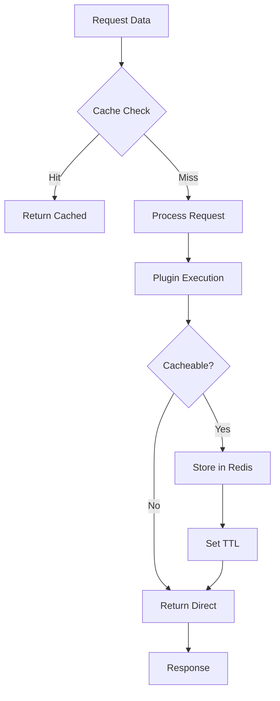

### Persistent Storage Pattern

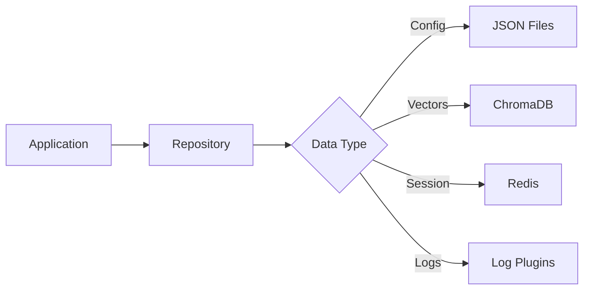

## Security Architecture

### Authentication & Authorization Flow

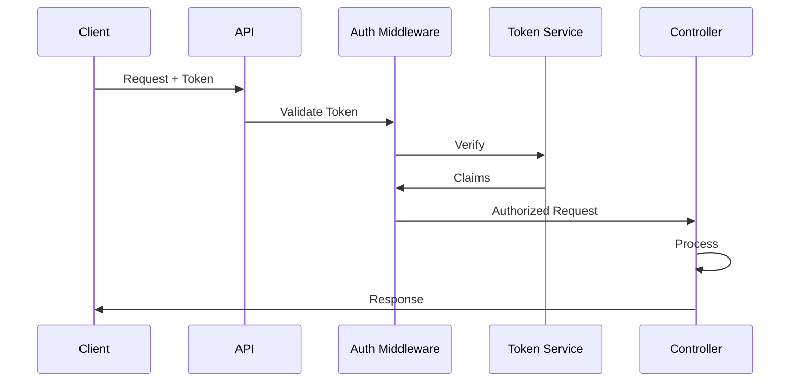

### Security Layers

```
┌─────────────────────────────────────┐
│         TLS/HTTPS Layer             │
├─────────────────────────────────────┤
│     Authentication Middleware       │
├─────────────────────────────────────┤
│      Authorization Policies         │
├─────────────────────────────────────┤
│        Input Validation            │
├─────────────────────────────────────┤
│      Plugin Sandboxing             │
├─────────────────────────────────────┤
│     Configuration Encryption       │
└─────────────────────────────────────┘
```

## Deployment Architecture

### Container Architecture

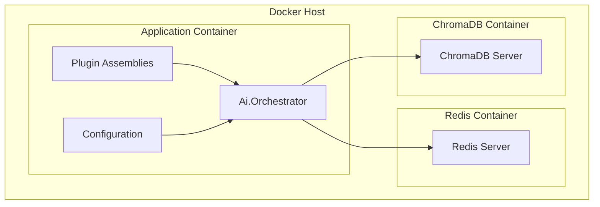

### Scalability Architecture

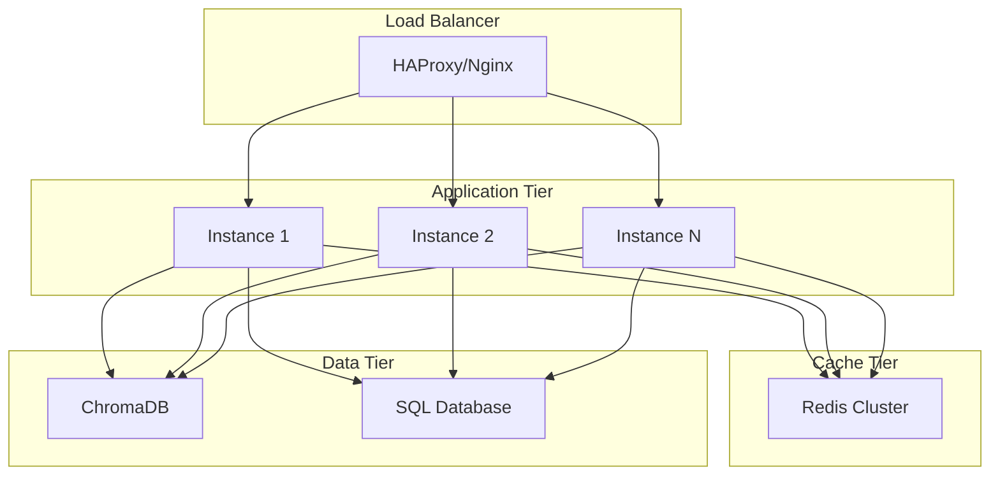

## Communication Patterns

### Synchronous Communication
```
Client -> API -> Controller -> Service -> Plugin -> External Service
                                              ↓
Client <- API <- Controller <- Service <- Response
```

### Asynchronous Communication
```
Client -> API -> Controller -> Service -> Task Queue
   ↓                                          ↓
Response (Task ID)                    Background Worker
   ↓                                          ↓
Polling/Webhook                        Plugin Execution
   ↓                                          ↓
Final Result <------------------------  Complete
```

## Error Handling Architecture

### Error Propagation Flow

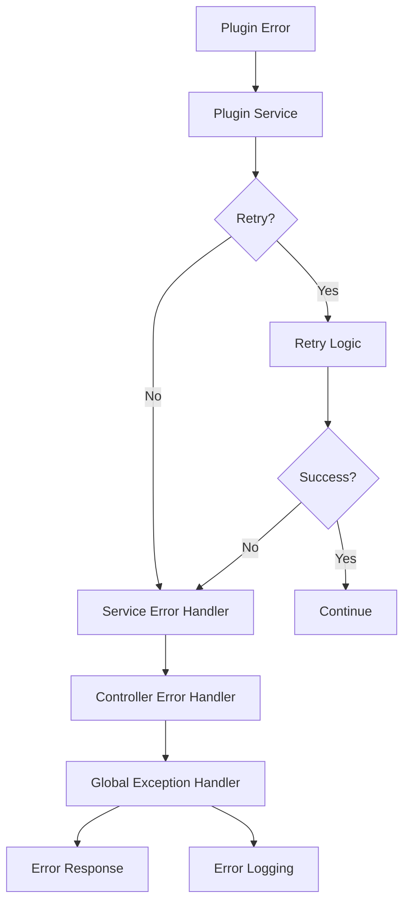

## Monitoring Architecture

### Observability Stack

```
┌──────────────────────────────────────┐
│         Application Metrics          │
│     (Performance, Throughput)        │
├──────────────────────────────────────┤
│          Business Metrics            │
│    (Plugin Usage, Success Rate)      │
├──────────────────────────────────────┤
│         System Metrics               │
│      (CPU, Memory, Network)          │
├──────────────────────────────────────┤
│            Log Aggregation           │
│        (Errors, Warnings, Info)      │
├──────────────────────────────────────┤
│            Health Checks             │
│      (Liveness, Readiness)           │
└──────────────────────────────────────┘
```

## Technology Stack Details

### Core Technologies
- **.NET 8.0**: Latest LTS framework
- **ASP.NET Core**: Web API framework
- **C# 12**: Latest language features
- **Entity Framework Core**: Future ORM
- **Docker**: Containerization

### Testing Stack
- **xUnit**: Test framework
- **Moq**: Mocking library
- **TestContainers**: Integration testing
- **BenchmarkDotNet**: Performance testing

### Infrastructure
- **Redis**: Caching and session
- **ChromaDB**: Vector database
- **PostgreSQL**: Future relational DB
- **RabbitMQ/Kafka**: Future message queue

## Performance Architecture

### Caching Strategy

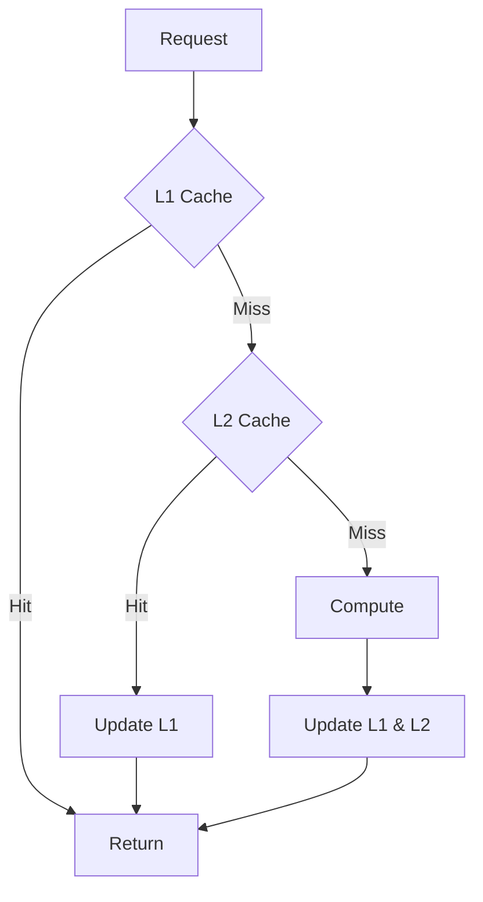

### Optimization Points
1. **Plugin Caching**: Instance reuse
2. **Response Caching**: Idempotent operations
3. **Connection Pooling**: Database and external APIs
4. **Async Operations**: Non-blocking I/O
5. **Lazy Loading**: On-demand plugin loading

## Future Architecture Evolution

### Microservices Migration Path

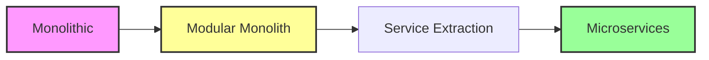

### Event-Driven Architecture

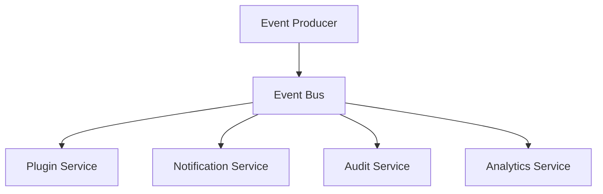

## Architecture Decision Records (ADRs)

### ADR-001: Plugin Architecture
- **Decision**: Use dynamic plugin loading
- **Rationale**: Maximum extensibility
- **Consequences**: Complex lifecycle management

### ADR-002: Async Everything
- **Decision**: All operations async
- **Rationale**: Scalability and performance
- **Consequences**: Increased complexity

### ADR-003: TDD Mandatory
- **Decision**: Test-driven development required
- **Rationale**: Quality and maintainability
- **Consequences**: Slower initial development

---

**Note**: All architectural changes must be test-driven. Write tests that validate architectural constraints before implementation.