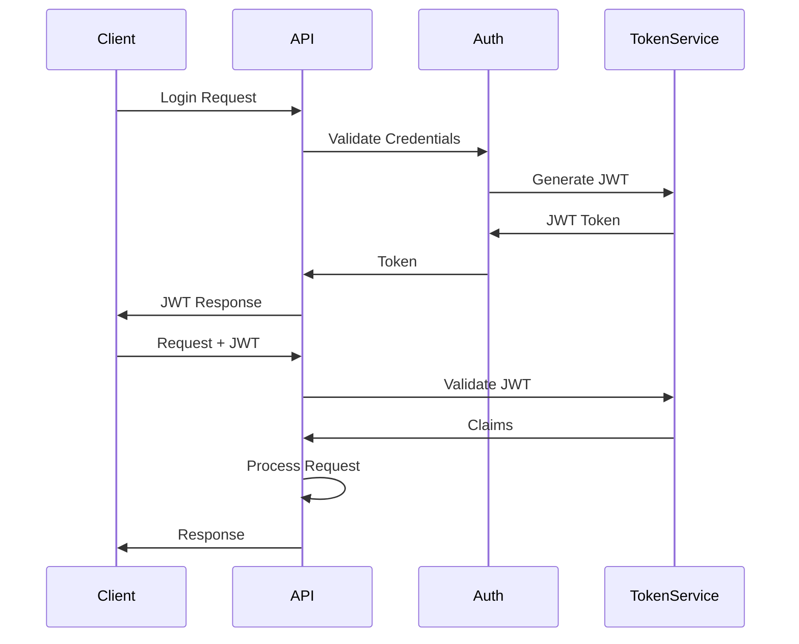

# Security Architecture - Ai.Orchestrator

## 🚨 SECURITY TESTS MUST BE WRITTEN FIRST 🚨

Before implementing ANY security feature, write tests that validate the security requirement. Only then implement the feature to pass the test.

## Current Security Status

### ⚠️ Critical Gaps Identified

1. **Authentication**: Not yet implemented (tests needed first)
2. **Authorization**: Basic structure only (tests needed first)
3. **Input Validation**: Partial implementation (comprehensive tests needed)
4. **API Rate Limiting**: Not implemented (tests needed first)
5. **Secrets Management**: Configuration in plain text (encryption tests needed)

## Security Architecture Overview

```
┌─────────────────────────────────────────────┐
│            Network Security                  │
│         (TLS/HTTPS, Firewall)               │
├─────────────────────────────────────────────┤
│         Authentication Layer                 │
│    (JWT, API Keys, OAuth - PLANNED)         │
├─────────────────────────────────────────────┤
│         Authorization Layer                  │
│      (RBAC, Policies - PLANNED)             │
├─────────────────────────────────────────────┤
│          Input Validation                   │
│    (Sanitization, Type Checking)            │
├─────────────────────────────────────────────┤
│         Plugin Sandboxing                   │
│     (Isolated Contexts, Permissions)        │
├─────────────────────────────────────────────┤
│        Data Protection                      │
│    (Encryption at Rest, In Transit)         │
└─────────────────────────────────────────────┘
```

## Authentication Implementation Plan

### Required Security Tests (WRITE FIRST!)

```csharp
// Test for missing authentication
[Fact]
public async Task API_WithoutToken_ShouldReturn401()
{
    var response = await client.GetAsync("/api/secure");
    Assert.Equal(HttpStatusCode.Unauthorized, response.StatusCode);
}

// Test for invalid token
[Fact]
public async Task API_WithInvalidToken_ShouldReturn401()
{
    client.DefaultRequestHeaders.Authorization =
        new AuthenticationHeaderValue("Bearer", "invalid");
    var response = await client.GetAsync("/api/secure");
    Assert.Equal(HttpStatusCode.Unauthorized, response.StatusCode);
}

// Test for expired token
[Fact]
public async Task API_WithExpiredToken_ShouldReturn401()
{
    var expiredToken = GenerateExpiredToken();
    client.DefaultRequestHeaders.Authorization =
        new AuthenticationHeaderValue("Bearer", expiredToken);
    var response = await client.GetAsync("/api/secure");
    Assert.Equal(HttpStatusCode.Unauthorized, response.StatusCode);
}
```

### JWT Authentication Design



### Implementation Approach (AFTER TESTS)
1. JWT token generation service
2. Token validation middleware
3. Refresh token mechanism
4. Token revocation support

## Authorization Strategy

### RBAC Tests (WRITE FIRST!)

```csharp
[Fact]
public async Task AdminEndpoint_WithUserRole_ShouldReturn403()
{
    var token = GenerateTokenWithRole("User");
    client.DefaultRequestHeaders.Authorization =
        new AuthenticationHeaderValue("Bearer", token);
    var response = await client.GetAsync("/api/admin");
    Assert.Equal(HttpStatusCode.Forbidden, response.StatusCode);
}

[Fact]
public async Task PluginAccess_WithoutPermission_ShouldBeDenied()
{
    var token = GenerateTokenWithoutPluginAccess();
    var response = await client.PostAsJsonAsync("/api/plugin/execute",
        new { plugin = "restricted" });
    Assert.Equal(HttpStatusCode.Forbidden, response.StatusCode);
}
```

### Permission Matrix

| Role | Read | Write | Execute | Admin |
|------|------|-------|---------|-------|
| Guest | ✓ | ✗ | ✗ | ✗ |
| User | ✓ | ✓ | ✓ | ✗ |
| Admin | ✓ | ✓ | ✓ | ✓ |
| Plugin | ✓ | ✓ | ✓ | ✗ |

## Input Validation & Sanitization

### Validation Tests (REQUIRED!)

```csharp
[Fact]
public async Task API_WithSQLInjection_ShouldBeSanitized()
{
    var maliciousInput = "'; DROP TABLE users; --";
    var response = await client.PostAsJsonAsync("/api/data",
        new { query = maliciousInput });

    // Verify input was sanitized, not executed
    Assert.Equal(HttpStatusCode.BadRequest, response.StatusCode);
}

[Fact]
public async Task API_WithXSS_ShouldBeEscaped()
{
    var xssPayload = "<script>alert('XSS')</script>";
    var response = await client.PostAsJsonAsync("/api/text",
        new { content = xssPayload });

    var content = await response.Content.ReadAsStringAsync();
    Assert.DoesNotContain("<script>", content);
}

[Fact]
public async Task API_WithOversizedInput_ShouldReject()
{
    var largeInput = new string('x', 1_000_001); // 1MB+
    var response = await client.PostAsJsonAsync("/api/text",
        new { content = largeInput });

    Assert.Equal(HttpStatusCode.RequestEntityTooLarge, response.StatusCode);
}
```

### Validation Rules

1. **String Inputs**
   - Max length: 10,000 characters
   - HTML encoding required
   - SQL parameter binding only

2. **File Uploads**
   - Max size: 10MB
   - Type validation
   - Virus scanning

3. **JSON Payloads**
   - Schema validation
   - Depth limit: 32 levels
   - Size limit: 1MB

## API Security

### Rate Limiting Tests

```csharp
[Fact]
public async Task API_ExceedingRateLimit_ShouldReturn429()
{
    for (int i = 0; i < 101; i++) // Limit: 100/minute
    {
        var response = await client.GetAsync("/api/data");
        if (i == 100)
        {
            Assert.Equal(HttpStatusCode.TooManyRequests, response.StatusCode);
        }
    }
}
```

### Rate Limiting Configuration
- **Anonymous**: 100 requests/minute
- **Authenticated**: 1000 requests/minute
- **Admin**: Unlimited
- **Per-Plugin**: Configurable limits

## Plugin Security

### Plugin Sandboxing Tests

```csharp
[Fact]
public void Plugin_ShouldNotAccessFileSystem()
{
    var plugin = new UntrustedPlugin();
    Assert.Throws<SecurityException>(() =>
        plugin.AccessFileSystem("/etc/passwd"));
}

[Fact]
public void Plugin_ShouldHaveMemoryLimit()
{
    var plugin = new MemoryIntensivePlugin();
    Assert.Throws<OutOfMemoryException>(() =>
        plugin.AllocateLargeMemory(1_000_000_000)); // 1GB
}
```

### Plugin Isolation
- Separate AppDomain/AssemblyLoadContext
- Resource quotas (CPU, Memory, I/O)
- Permission-based execution
- Network access control

## Secrets Management

### Secret Storage Tests

```csharp
[Fact]
public void Configuration_ShouldNotExposeSecrets()
{
    var config = ConfigurationManager.GetConfiguration();
    var json = JsonSerializer.Serialize(config);

    Assert.DoesNotContain("actual-api-key", json);
    Assert.Contains("***", json); // Masked
}

[Fact]
public void Secrets_ShouldBeEncryptedAtRest()
{
    var secretFile = File.ReadAllText("secrets.json");
    Assert.False(secretFile.Contains("plaintext"));
    Assert.True(IsEncrypted(secretFile));
}
```

### Secret Management Strategy
1. **Development**: Environment variables
2. **Production**: Azure Key Vault / AWS Secrets Manager
3. **Configuration**: Encrypted JSON files
4. **Runtime**: In-memory only, no logging

## Data Protection

### Encryption Tests

```csharp
[Fact]
public void SensitiveData_ShouldBeEncrypted()
{
    var sensitiveData = "SSN: 123-45-6789";
    var encrypted = DataProtection.Encrypt(sensitiveData);

    Assert.NotEqual(sensitiveData, encrypted);
    Assert.True(encrypted.StartsWith("enc:"));
}

[Fact]
public void DatabaseConnection_ShouldUseTLS()
{
    var connectionString = Configuration.GetConnectionString("ChromaDB");
    Assert.Contains("SSL=true", connectionString);
    Assert.Contains("TrustServerCertificate=false", connectionString);
}
```

### Encryption Standards
- **At Rest**: AES-256-GCM
- **In Transit**: TLS 1.3 minimum
- **Key Rotation**: Every 90 days
- **Key Storage**: Hardware Security Module (HSM)

## Security Headers

### Required Headers Tests

```csharp
[Fact]
public async Task API_ShouldHaveSecurityHeaders()
{
    var response = await client.GetAsync("/api/health");

    Assert.Contains(response.Headers, h => h.Key == "X-Content-Type-Options");
    Assert.Contains(response.Headers, h => h.Key == "X-Frame-Options");
    Assert.Contains(response.Headers, h => h.Key == "Content-Security-Policy");
    Assert.Contains(response.Headers, h => h.Key == "Strict-Transport-Security");
}
```

### Security Headers Configuration
```csharp
X-Content-Type-Options: nosniff
X-Frame-Options: DENY
X-XSS-Protection: 1; mode=block
Content-Security-Policy: default-src 'self'
Strict-Transport-Security: max-age=31536000; includeSubDomains
```

## Vulnerability Assessment

### Current Vulnerabilities

| Vulnerability | Severity | Status | Mitigation |
|--------------|----------|--------|------------|
| No Authentication | CRITICAL | Open | Implement JWT (tests first) |
| Plain Text Secrets | HIGH | Open | Encrypt configuration |
| No Rate Limiting | MEDIUM | Open | Add rate limiter |
| Missing CSRF Protection | MEDIUM | Open | Add CSRF tokens |
| Verbose Error Messages | LOW | Open | Sanitize error responses |

## Security Testing Strategy

### Test Categories

1. **Authentication Tests**
   - Token validation
   - Session management
   - Multi-factor authentication

2. **Authorization Tests**
   - Role-based access
   - Resource permissions
   - Plugin access control

3. **Input Validation Tests**
   - SQL injection
   - XSS attacks
   - Command injection
   - Path traversal

4. **Security Misconfiguration Tests**
   - Default credentials
   - Exposed endpoints
   - Debug mode detection

## Compliance Requirements

### OWASP Top 10 Coverage

| Risk | Status | Tests | Implementation |
|------|--------|-------|----------------|
| A01: Broken Access Control | ❌ | Needed | Planned |
| A02: Cryptographic Failures | ⚠️ | Partial | In Progress |
| A03: Injection | ⚠️ | Partial | In Progress |
| A04: Insecure Design | ❌ | Needed | Planned |
| A05: Security Misconfiguration | ❌ | Needed | Planned |
| A06: Vulnerable Components | ✅ | Done | Monitoring |
| A07: Authentication Failures | ❌ | Needed | Planned |
| A08: Data Integrity Failures | ❌ | Needed | Planned |
| A09: Logging Failures | ⚠️ | Partial | In Progress |
| A10: SSRF | ❌ | Needed | Planned |

## Security Monitoring

### Logging Requirements

```csharp
// Test for security event logging
[Fact]
public async Task FailedLogin_ShouldBeLogged()
{
    await client.PostAsJsonAsync("/api/login",
        new { user = "admin", password = "wrong" });

    var logs = await GetSecurityLogs();
    Assert.Contains(logs, l => l.Event == "LOGIN_FAILED");
}
```

### Security Events to Log
- Authentication attempts (success/failure)
- Authorization failures
- Input validation failures
- Rate limit violations
- Configuration changes
- Plugin execution
- Data access patterns

## Incident Response Plan

### Response Procedures
1. **Detection**: Automated alerts
2. **Containment**: Isolate affected components
3. **Investigation**: Analyze logs and traces
4. **Remediation**: Apply fixes (test first!)
5. **Recovery**: Restore services
6. **Post-Mortem**: Document and improve

## Security Roadmap

### Q4 2024
- [ ] Implement JWT authentication (tests first)
- [ ] Add basic RBAC (tests first)
- [ ] Encrypt configuration (tests first)

### Q1 2025
- [ ] Add rate limiting (tests first)
- [ ] Implement CSRF protection (tests first)
- [ ] Add security headers (tests first)

### Q2 2025
- [ ] Plugin sandboxing (tests first)
- [ ] Advanced threat detection (tests first)
- [ ] Penetration testing

## Security Best Practices

### Development Guidelines
1. **Never trust user input** - Validate everything
2. **Principle of least privilege** - Minimal permissions
3. **Defense in depth** - Multiple security layers
4. **Fail securely** - Deny by default
5. **Test security first** - TDD for security features

### Code Review Checklist
- [ ] Authentication checks present
- [ ] Authorization verified
- [ ] Input validated and sanitized
- [ ] Secrets not hardcoded
- [ ] Security tests written first
- [ ] Error messages sanitized
- [ ] Logging appropriate

---

**CRITICAL REMINDER**: Every security feature MUST have tests written first. No security implementation without failing tests that define the security requirement.